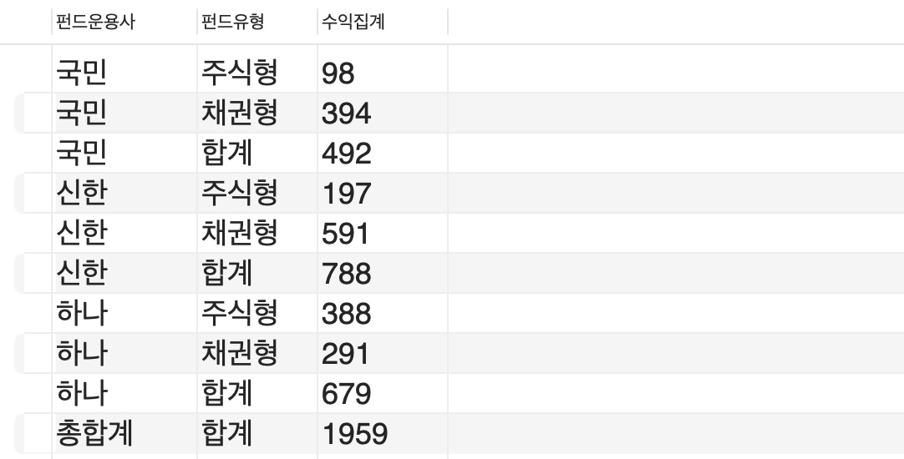

# ORACLE DB

## Oracle Data Type

#### CHAR(n)

- 고정길이 문자 (숫자인 문자열)

#### VARCHAR2(n)

- 가변길이 문자 (문자열)

#### NUMBER(P, S)

- 가변숫자

#### DATE

- 날짜


## Alias 표현방법 3가지

```sql
SELECT sal*12 AS "ANNSAL",
			 sal*12 "ANNSAL",
			 sal*12 ann_sal
FROM emp;
```


## ORDER BY 표현방법 3가지

```sql
ORDER BY sal*12 DESC, ename;  # column
ORDER BY 4 DESC, ename;	# 위치지시자
ORDER BY "연봉" DESC, ename;	# alias
```


## Function 


---


# SQL

## SQL 내부처리 순서

```sql
WHERE -> GROUP BY -> SELECT -> ORDER BY
```


## SQL 기술 순서

```sql
SELECT -> FROM -> WHERE -> GROUP BY -> HAVING -> ORDER BY
```


## where > group by

- 특정 조건을 만족하는 row 만 그룹화할 경우
- group by 전에 조건을 주면, 조건을 걸고 그룹화한다.

```sql
select bank_name, sum(balance) as balance_sum
from accounts
where balance > 10
group by bank_name
order by balance_sum desc
```


## group by > having

- group by 결과물에 조건을 걸 경우
- group by 이후에 having 으로 조건을 주면, 그룹화한 결과를 필터링한다.

```sql
select bank_name, sum(balance) as balance_sum
from accounts
where balance > 10
group by bank_name
having sum(balance) > 10
order by balance_sum desc
```


## A별 B별 그루핑

- group by 2개로 : shop 별 method 별 그루핑

```sql
select *
from sales
left join shops on sales.f_shop = shops.seq
) ss left join fund_method on f_method = fund_method.id)
where type = "주식형" or (type = "채권형" and is_selling = "Y")
group by f_shop, f_method
order by f_shop
) tt
```


## CASE WHEN THEN 조건에 따른 SELECT 문

- fee_type이 "S" 이면 0.015, "N"이면 0.03 을 곱한 결과를 출력

```sql
select
	s_name, type,
	case
		when fee_type="S" then truncate(sum(t_amount) - sum(t_amount) * 0.015, 0)
		when fee_type="N" then truncate(sum(t_amount) - sum(t_amount) * 0.03, 0)
	end as tt_amount
from
...
```


## 소수점 반올림(round), 올림(ceil), 내림(floor), 버림(truncate)

```sql
select truncate(1.5, 0)  -- 1
select round(1.5, 0)  -- 2
select ceil(1.5, 0) -- 1
select floor(1.5, 0) -- 1
```


## 총합계 내기 with rollup + 열까지 지정하기

```sql
select 
	if(grouping(s_name), "총합계", s_name)"펀드운용사", 
    if(grouping(type), "합계", type)"펀드유형",
    sum(tt_amount) as "수익집계"
from (
...
	) tt
group by s_name, type
with rollup
```


